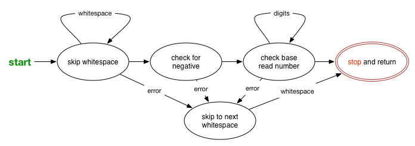

---
# Feel free to add content and custom Front Matter to this file.
# To modify the layout, see https://jekyllrb.com/docs/themes/#overriding-theme-defaults

layout: default
permalink: /assignments/hw4
title: HW4 - Bits are Bits

---

# CSCI 241 - Homework 4: Bits are bits

<em>Due by 11:59.59pm Tuesday, October 25</em>

## Introduction

In this lab you will get experience dealing with data on the binary level.
You will also have to deal with static local variables and using global
variables.  In addition, you'll be expected to use conditional compilation
via a Makefile, creating header files, etc.

You will work with a partner on this assignment.  
It is expected that you work together and equally contribute to the 
development of your solution.  Also, you are both responsible for understanding
how your solution works.  You need only submit one assignment per group, but
clearly indicate your partnership in the README and comments for files.  You should play with collaborating on github as you are doing this.

The URL for the github repository for this account is <a href="https://classroom.github.com/a/LD7tDRBS">https://classroom.github.com/a/LD7tDRBS</a>

## Part 1 - converting data to binary and back

In this part, you will be creating 2 programs.  <tt>encode_bits</tt> which
will generate the "binary" representation of a file and <tt>decode_bits</tt>
which will take that representation and convert it back to the original
format.

### encode_bits

Create a program called <tt>encode_bits</tt>.  This program should use
<tt>getchar()</tt> to read in characters one at a time and then call
<tt>print_bits()</tt> (<a href="#print_bits">see below</a>) to output that
character as a sequence of '1' and '0' characters.  It should stop on EOF.

### decode_bits

Create a program called <tt>decode_bits</tt>.  This program should use
<tt>getchar()</tt> to read in characters one at a time and then call
<tt>decode_bits()</tt> (<a href="#decode_bits">see below</a>) to output that
sequence of '1' and '0' characters as actual characters. It should stop on
EOF.

### bits.c &amp; bits.h

Create a file called <tt>bits.c</tt> that contains the following two
functions and a header file <tt>bits.h</tt> that contains a guard against
multiple inclusion, other needed includes, and function prototypes.

`void print_bits(int ch)`

Takes the character `ch` and outputs its value in binary format
with all leading zeros and with the MSB first. For example, the letter 'A'
has a value of 0x41, and should be output as `01000001`.  A newline
character has a value of `0x0a` and should be output as `00001010`.

You should not assume the number of bits that are in a char, instead use
the constant `CHAR_BIT` from limits.h.

`void decode_bits(int ch)`

If the character is whitespace, skip it.  (You might want to use
`isspace`() in ctype.h.)

If the character is a '1' or a '0', you should add it into an output
buffer (numerically, shifting the current contents appropriately).
Once you've seen CHAR_BIT bits, you should print the corresponding
character out.

If the character is neither white space, nor a binary digit, you should
print a message to the screen, and then use `exit()` to quit your
program with a non-zero value.

### Programming hints for part 1

You'll probably need to use static local variables to handle
`decode_bits` since it only prints out a character every CHAR_BIT
calls to it.

Don't forget to make rules in your Makefile include the correct
compilation.  `bits.o` should be the dependency for the two other
programs, and you should have a separate rule for its compilation.

## Part 2 - Number Transformation

For the second part, you will be creating a function to read in a positive
integer value and storing the result in a `long` integer variable.
You will also be creating 4 short programs that will use that function to
read in integers and output them in one of 4 different formats -- binary,
decimal, octal, or hexadecimal.

### reading in a number

Create a file called `getnum.c` and another called
`getnum.h`.  In `getnum.c` you will create the function
`getnum()` that is used by your other programs.

`long getnum(void)`
Read in a positive integer in one of 4 formats described below and then
return the value.

Skip leading whitespace and stop reading in a number on the next
occurrence of whitespace.

* <b>**Binary**</b> - begins with a leading `0b` and then a
sequence of `0` and `1` characters
* <b>**Octal**</b> - begins with a leading `0` followed by 1 or
more digits from 0-7
* <b>**Decimal**</b> - either a single `0` or a digit from 1-9
followed by zero or more digits from 0-9 
* <b>**Hexadecimal**</b> - begins with a leading `0x` followed by 1
or more digits from 0-9 or A-F

If the integer read is invalid, somehow signal the caller that the value
returned is not valid.  I'd suggest you consider a global variable.

If the input is invalid, skip to the next whitespace in the input or EOF.

You might find it useful to "unread" a character.
You can do so using `ungetc(ch, stdin);` where "ch" is the character
you just read.  Note that you can only un-read one character at a time
until you read in a new character.

Building a state diagram like the one below might be useful in
visualizing the behavior of this function.  Note: The image includes the case for negative numbers, which are not part of the main assignment.

### Printing out a number

You will then create 4 short programs that will read in a sequence of number
and then output them one per line in a specified format.  All 4 will be
using sign-magnitude format.  (If negative, print out the sign and then the
rest as if it were positive -- important for binary.)

* `tobinary` - outputs the signed value in binary with a leading `0b`
* `todecimal` - outputs the signed value in base 10 with no leading `0` characters
* `tooctal` - outputs the signed value in base 8 with a single leading `0`

* `tohex` - outputs the signed value in base 16 (uppercase) with a leading `0x`

In the event that the integer being read is invalid, simply print
"`ERROR`" to the screen.

Loop until no more integers remain.

### Programming hints for part 3
* You will probably want to have more functions than just the one required in this
part.  You can also have other functions or global flags that can be used by
the toBASENAME programs.

* You may ignore the possibility of an integer overflow in the numbers you read.

* At no point in time should your program segfault or generate errors when running under valgrind.

* Be sure your program can handle both upper and lower case in hex. 
("man ctype" for inspiration)

* Be sure to handle the special case of single '0' character.

* Be sure to handle the case where EOF immediately follows a valid integer.

Don't forget to add these targets into your Makefile.

## The rest of the info

### Sample program

I've included my sample solution in `~rhoyle/pub/cs241/hw4/` with
binaries that should work on the lab machines.

<tt>`decode_bits`</tt> should exactly undo <tt>`encode_bits`</tt>.  For example,
you should get no output from the following:

<pre class="boxed">
% ./encode_bits &lt; ./encode_bits | ./decode_bits &gt; output 
% diff -q encode_bits output 
</pre>

You can also chain together the base transformation if you like

<pre class="boxed">
% echo 32767 0xffff 071 0b101 cat | ./tobinary | ./tohex | ./tooctal | ./todecimal 
32767
65535
57
5
ERROR
</pre>

### Extra Credit
Read in a flag <b>on the command line</b> that specifies the base for the output.  It should be one of:

* <b>-b</b>: binary (the default, as specified above)
* <b>-o</b>: octal (convert all 3-bit strings into a number from 0-7)
* <b>-h</b>: hex (convert all 4-bit strings into a number from 0-F)

Note, your output, if octal, should be the regular number without the leading 0.  The number, if hex, should be the regular number without the leading 0x.  You will need to modify both `encode_bits` and `decode_bits` for full credit, as you'll need to be able to decode each type of encoding.
Handle negative numbers

### README

As with the first project, I want you to create a file called <tt>`README`</tt>

* Your name (and partner's name) and the date
* A list of the programs with a short one-line description of each
* A description of how someone should use your version of
<tt>`getnum()`</tt> including a description of how it signals the validity of
the value read.
* A list of all remaining compilation problems, warnings, or errors.
Note that for full marks, it is expected that you will have corrected
all of these things.
* A statement about any valgrind errors which occur
* An estimate of the amount of time you spent designing, implementing, and
debugging these programs
* The honor code statement:
<q class="honor">I have adhered to the Honor Code in this assignment</q>
		

### Submission

Now you should <tt>`make clean`</tt> to get rid of your executables and
commit your folder containing your source files, README, and Makefile through git, as you did in last week's assignment.  For a refresher, refer to those instructions.

<!---
<pre class="boxed">
% <tt>cd ~/cs241</tt>
% <tt>handin -c 241 -a 4 hw4</tt>
% <tt>lshand</tt>
</pre 
--->
### Grading

Here is what I am looking for in this assignment:

* A working Makefile with your programs, all, and clean as targets
* All programs should have comments including your name and date at the
top.  Functions should have a brief description of what they do and an
explanation of their return values.
* All programs should compile using `gccx`</tt> on clyde
with no compiler warnings or errors.
* All programs should run using <tt>`valgrind`</tt> on clyde
with no warnings or errors.

<address>Last Modified: October 07, 2022 - <a href="mailto:rhoyle@oberlin.edu">Roberto Hoyle</a>, with material from Ben Kuperman</address>
